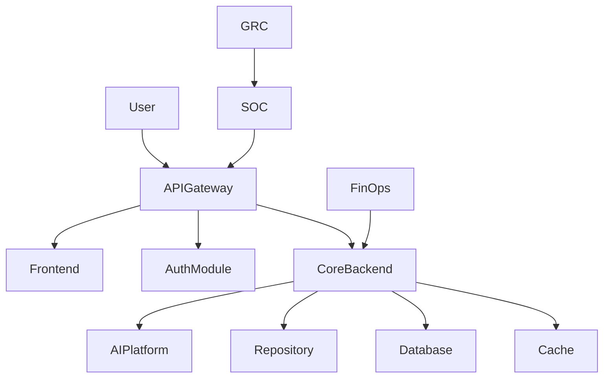

# Platform Dependency Map

```mermaid
graph TD
    User --> APIGateway
    APIGateway --> Frontend
    APIGateway --> AuthModule
    APIGateway --> CoreBackend
    CoreBackend --> AIPlatform
    CoreBackend --> Repository
    CoreBackend --> Database
    CoreBackend --> Cache
    SOC --> APIGateway
    FinOps --> CoreBackend
    GRC --> SOC
```
