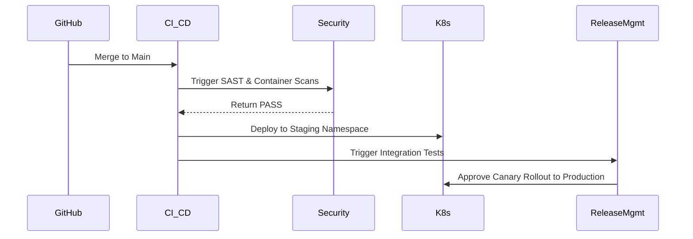

# Deployment Sequence Flow

```mermaid
sequenceDiagram
    participant GitHub
    participant CI_CD
    participant Security
    participant K8s
    participant ReleaseMgmt
    
    GitHub->>CI_CD: Merge to Main
    CI_CD->>Security: Trigger SAST & Container Scans
    Security-->>CI_CD: Return PASS
    CI_CD->>K8s: Deploy to Staging Namespace
    CI_CD->>ReleaseMgmt: Trigger Integration Tests
    ReleaseMgmt->>K8s: Approve Canary Rollout to Production
```
